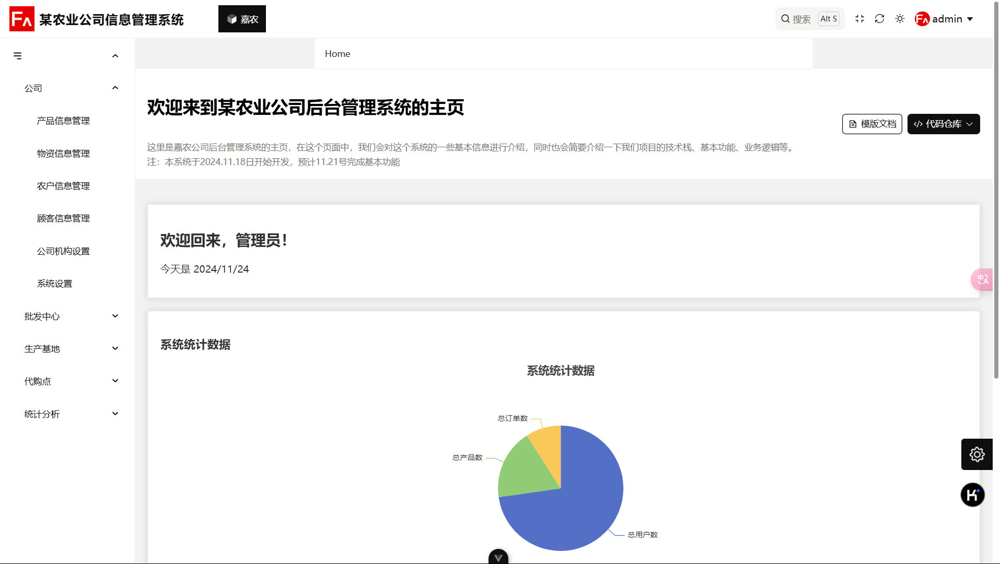
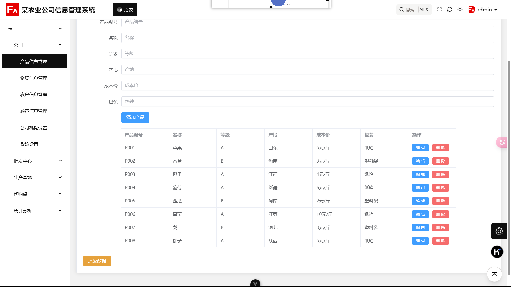
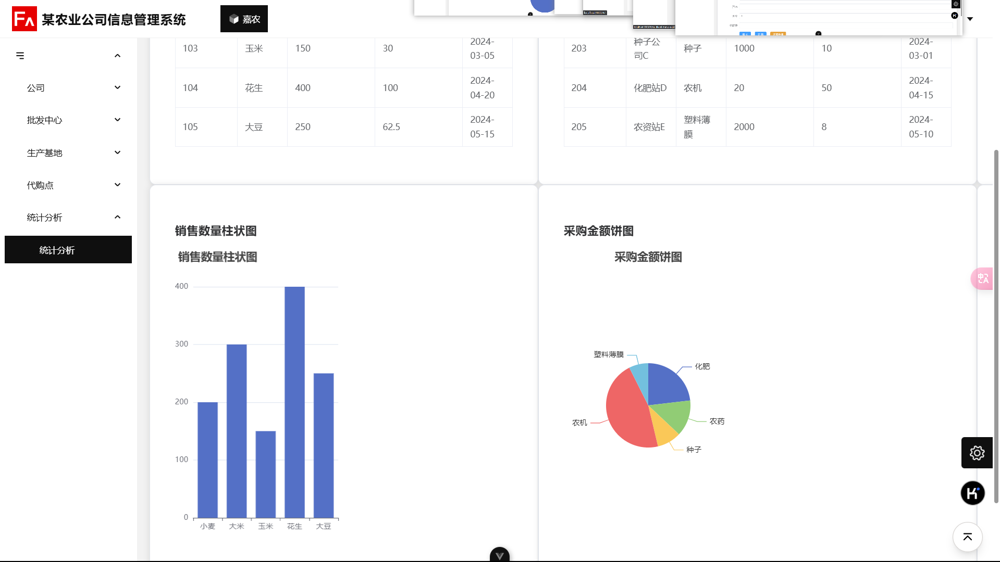
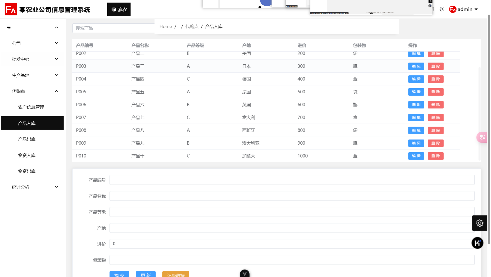
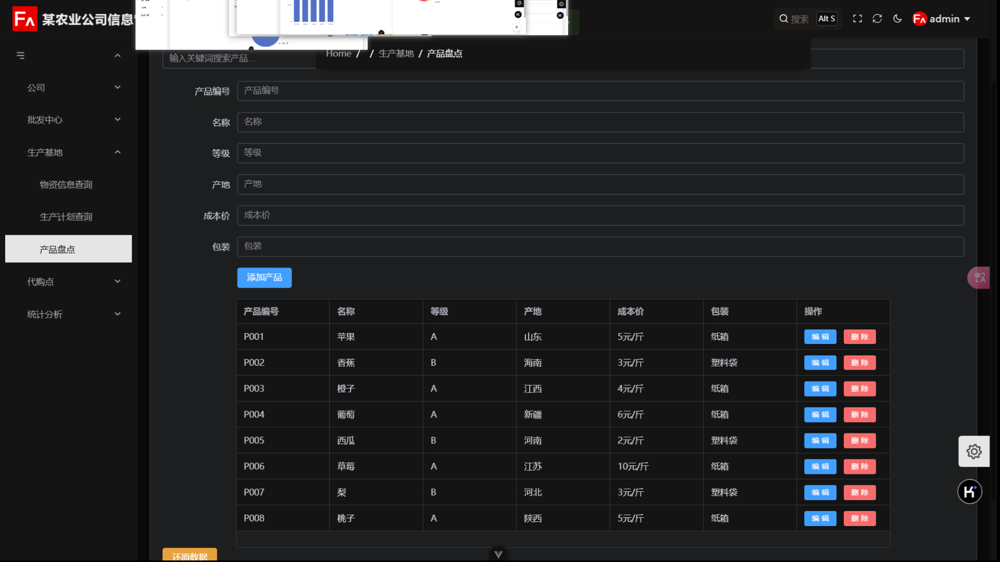
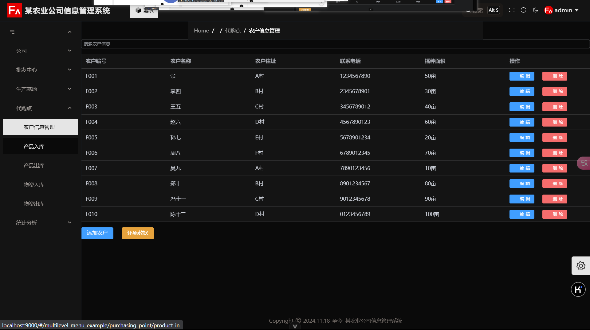
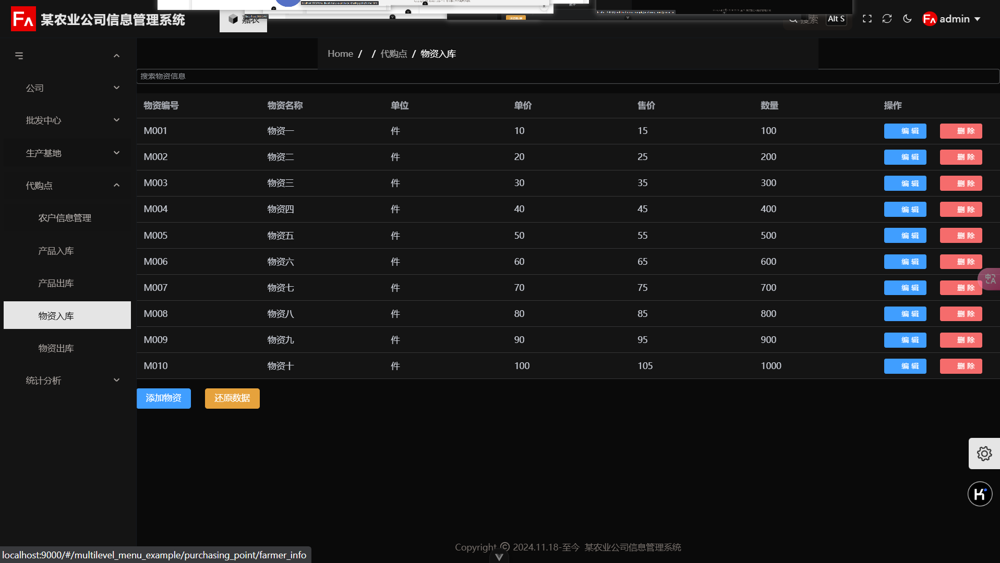

# 后台管理系统

## 预览

> 两种主题：白天和黑夜










## 简介

> 后台管理系统

本项目是一个基于vue3和fantastic—admin后台管理模板搭建成的某农业公司后台管理系统

## 技术栈

**vue3 +vite + ts +pinia +vue-router + axios +echart + elementplus**

## 部署

```
//项目指定包管理器为pnpm
npm i pnpm -g
//使用pnpm安装项目依赖
pnpm i
//项目启动命令
pnpm run dev
//项目打包
pnpm run build
```

